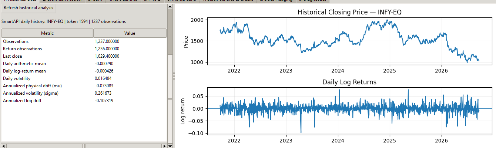
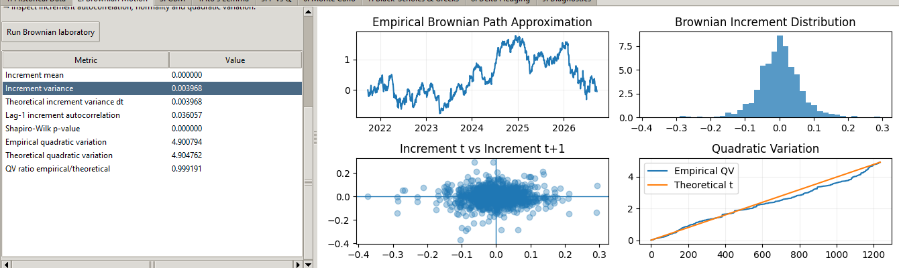
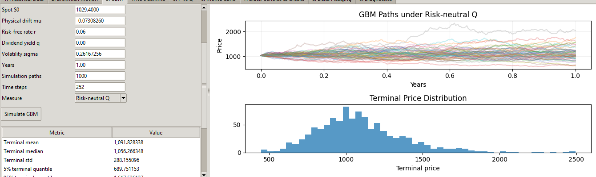
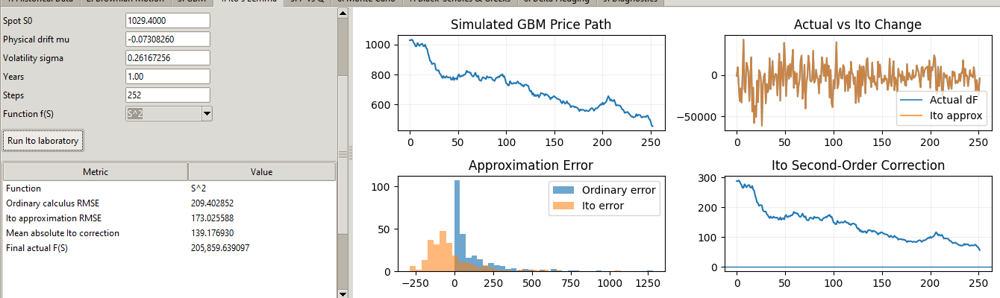
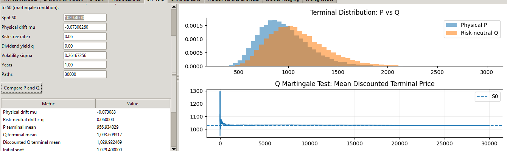
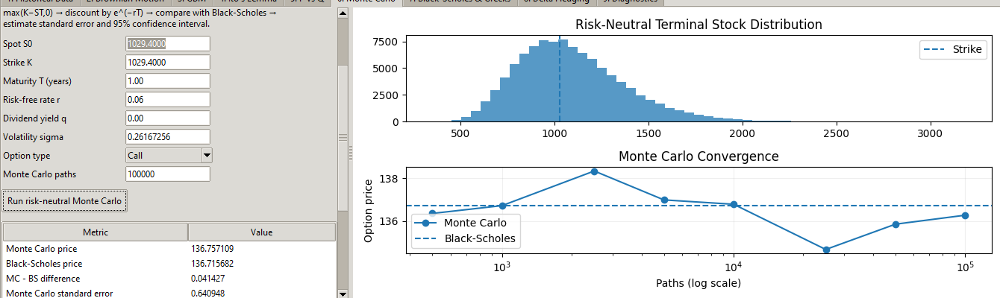
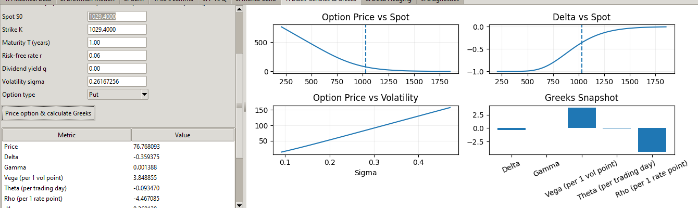
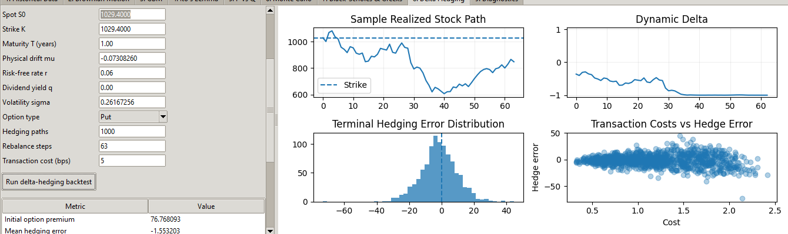
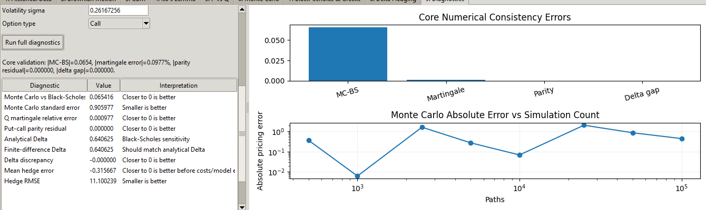

# HELM Risk-Neutral Stochastic Calculus & Derivatives Pricing Laboratory

An interactive Python research application that connects historical equity data with the mathematical workflow used to price and hedge European options.

## Research workflow

1. Load historical NSE equity prices through Angel One SmartAPI or CSV.
2. Estimate physical drift and annualized volatility from log returns.
3. Examine standardized shocks as an empirical Brownian-motion approximation.
4. Simulate geometric Brownian motion under the physical measure **P** and risk-neutral measure **Q**.
5. Demonstrate the second-order correction in Ito's lemma.
6. Price European calls and puts with Black-Scholes and risk-neutral Monte Carlo.
7. Calculate Delta, Gamma, Vega, Theta and Rho.
8. Simulate discrete dynamic delta hedging with transaction costs.
9. Validate results with martingale, put-call parity, finite-difference Delta and pricing-convergence diagnostics.

## Screenshots

### Historical data and estimated parameters



### Brownian-motion diagnostics



### Risk-neutral GBM simulation



### Ito's lemma experiment



### Physical measure P versus risk-neutral measure Q



### Risk-neutral Monte Carlo pricing



### Black-Scholes and Greeks



### Dynamic delta hedging



### Numerical diagnostics



All screenshots were cropped to the analytical workspace. No API key, PIN, TOTP secret or client code is shown.

## Installation

```bash
python -m venv .venv
```

Activate the environment, then install dependencies:

```bash
pip install -r requirements.txt
```

## Run

```bash
python main.py
```

Run the mathematical self-tests:

```bash
python main.py --self-test
```

Optional interactive SmartAPI smoke test:

```bash
python main.py --smartapi-smoke-test
```

## Important interpretation

This project is a stochastic-calculus and derivatives-pricing laboratory. Its option values are theoretical model estimates based on the selected strike, maturity, interest rate, dividend yield and volatility. They are not live NSE option premiums, trade recommendations or investment advice.

## Model limitations

- GBM and Black-Scholes assume lognormal prices and constant volatility.
- Historical volatility is not the same as market-implied volatility.
- Delta hedging uses simulated paths and discrete rebalancing.
- Real markets include volatility smiles, jumps, liquidity constraints and execution slippage.

## Author

Ashish Kumar A — HELM FINSERV

## License

MIT License. See [LICENSE](LICENSE).
